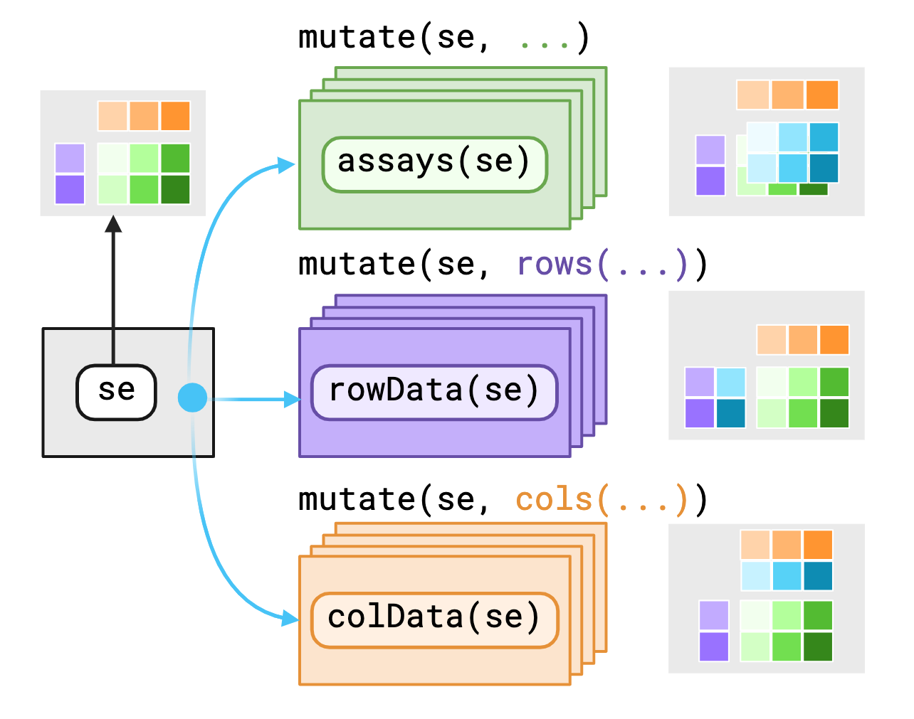

## Motivation

 Figure 1.](./treeClimbR.png)

::: columns

::: {.column width="50%"}

:::

::: {.column width="50%"}
::: {.row}
{width="100" fig-align="center"}
:::

::: {.row}
```r
xp |>
  group_by(
    rows(gene_id)
  ) |>
  mutate(
    rows(
      tree = cluster_transcripts(trans) |>
        tree_vec(...)
    )
  )
```
:::
:::

:::


```{r package setup, message=FALSE, warning=FALSE}
library(TreeSummarizedExperiment)
library(plyxp)
library(treeClustDemo)
library(ggtree)
```

### Data Setup

```{r}
set.seed(42)
nfeat <- 10000L
nsamp <- 100L
se <- SummarizedExperiment(
  assays = list(counts = matrix(rpois(nfeat * nsamp, 10), nfeat, nsamp)),
  rowData = DataFrame(
    feature = sprintf("f%04i", seq_len(nfeat)),
    length = sample(1e3:1e5, nfeat, replace = TRUE)
  ),
  colData = DataFrame(
    sample = sprintf("s%02i", seq_len(nsamp))
  )
)

.rowtree <- ape::rtree(nfeat)
tse <- TreeSummarizedExperiment(
  assays = assays(se),
  rowData = rowData(se),
  colData = colData(se),
  rowTree = .rowtree,
  rowNodeLab = sample(.rowtree$tip.label)
)

ggtree(rtree(100), size = 2, branch.length = "none") +
    geom_text2(aes(label = node), color = "darkblue",
               hjust = -0.5, vjust = 0.7, size = 5.5) +
    geom_text2(aes(label = label), color = "darkorange",
               hjust = -0.1, vjust = -0.7, size = 5.5) +
    ggplot2::labs(title = "Example tree with 100 leafs")
    
```

## The Goal

Provide some tidyomics styled abstraction over `TreeSummarizedExperiment` (`treeSE`). 
As noted from a prior meeting, the main utility for `treeSE` 
<!-- perhaps there are other utilities that I am unware of -->
is the ability to not only store and map arbitrary trees to the rows or columns of the `SummarizedExperiment` (`SE`), but also provide utility functions for extracting data by nodes or summarizing data to some level of the internal tree nodes.

In tidyomics, there are two stylings to approach this abstraction.
We could apply the relaxed styling of `TidySummarizedExperiment` (`tidySE`) or we could approach from a more verbose styling of `plyxp`. I will be demonstrating the approach from `plyxp`

## Background `treeSE`

.](./treeSE-overview.png)

In the above figure, we can see how the `treeSE` package chose to map arbitrary `phylo` trees to data within an `SE` object.
The data is mapped by either the  "rowLink" or "colLink" data structure.


```{r}
rowTree(tse, whichTree = 1L)
rowLinks(tse)
```

The key to this stucture is the "LinkDataFrame" class, which is meant to be parallel to the associated `rowData` or `colData` of the `SE` object.
In other words, the `i`th observation of the `rowLinks` will hold a mapping to some node of the `rowTree`, which in turns maps to the `i`th row of the `SE` object.

## Applying `plyxp` to tree Structures

The work at present is not a complete implementation of `tidyomics` for the `treeSE` class, however it does provide building blocks that could lead to its implementation.

The reason a complete implementation hasn't been made is that the internals `plyxp` relies on to do it properly have not yet been exported and are not yet stable.

That being said, `plyxp` works as intended with normal vectors or S4Vectors within the `rowData` or `colData`.
Thus this proof of concept abstracts the mapping of the `LinkDataFrame` into a similar custom structure, a `tree_vctr`, in order to demonstrate the funcitonality.

### Anatomy of a `tree_vctr`

A `tree_vctr` is an S3 vector built on top of the "vctrs_rcrd" class from the `vctrs` package.
It is meant to be a light weight, self contained structure, that provides similar funcitonality of the `rowLinks()` and `rowTree()` functions.

```{r}
tree_vec <- tree_vctr(.rowtree)
# attribute: tree -> list of hclust objects
# data: data.frame(which_tree: <factor>, node: <integer>)
#   which_tree is factor incoding where
#   - level 1 maps to tree index 1,
#     level 2 maps to tree index 2, ... etc
#   - levels are computed by `digest::digest` 
#     the hclust objects
# 
#   node is an integer representing the node of tree i
#   - This number depends on the size of the tree.
#     If tree 1 has N leafs, then node cannot be 
#     greater than M = N * (N - 1)
# 
#   The output for each element is formated as:
#     <which_tree>:<node_id>
c(head(tree_vec), tail(tree_vec))
```

Because it is built on top of the `vctrs` package, standard book keeping is retained as you subset, or reorder the vector.

The intent of this object is to sit alongside other vectors to annotate these objects. 
This differs from `treeSE` in that the `LinkDataFrame` and the `rowTree()` list are separate objects that live on a `treeSE` object.
By themselves, they are not informative.
The `tree_vctr` abstracts this metadata as a stand-alone vector that can be used by composition with any standard `SE` object.

::: {.callout-note}

node labeling between hclust and phylo objects are not consistant.
In phylo objects, integers in the `edge` field represents the node identifiers.
In hclust objects, integers in the `merge` field encode observations of the input data, and node ids are calculated by doing `match(merge, hc$order)`.
Internal nodes in hclust objects are also ordered based on height, thus the "root" or top parent always has the largest node id.

:::

The `tree_vec` object is not yet properly mapped to our data.
We can use data from our `tse` object to properly map the nodes.

```{r}
rowData(se)$tree <- tree_vec[rowLinks(tse)$nodeNum]
rowData(se)
```

### Utility functions for `tree_vctr`

```{r}
.tvec <- sample(tree_vec, 10)
tree_id(.tvec) # get tree index as integer
node_id(.tvec) # get node id
tree(.tvec) # expects only 1 tree
trees(.tvec) # returns all trees
is_inner(.tvec) #logical vector if node is inner node
tail(inner_nodes(.tvec)) # for each tree, generate all inner nodes
.parent <- parent_nodes(.tvec) # get the parent of a node
.parent
child_nodes(.parent) # get children from a parent
```

## Benchmarking against `aggTSE`

```{r}
## Get a list of all node IDs
all_tse_nodes <- showNode(tree = rowTree(tse), only.leaf = FALSE)
```

```{r}
## Calculate counts for internal nodes
agg_tse <- aggTSE(x = tse, rowLevel = all_tse_nodes, rowFun = sum)
agg_tse |> assay() |> _[1:5, 1:5]

## treeClustDemo provides a helper grouping function
#  group_by_nodes, which helps specify the node level to group at

xp <- new_plyxp(se)
all_nodes <- xp |>
  group_by_nodes(rows(all_nodes(tree))) |>
  summarize(counts = colSums(counts)) 
all_nodes |>
  pull(counts) |>
  _[1:5, 1:5]

```


```{r}
bench::mark(
  aggTSE = aggTSE(x = tse, rowLevel = all_tse_nodes, rowFun = sum),
  plyxp = xp |>
    group_by_nodes(rows(all_nodes(tree))) |>
    summarize(counts = colSums(counts)),
  check = FALSE,
  memory = FALSE
)

microbenchmark::microbenchmark(
  aggTSE = aggTSE(x = tse, rowLevel = all_tse_nodes, rowFun = sum),
  plyxp = xp |>
    group_by_nodes(rows(all_nodes(tree))) |>
    summarize(counts = colSums(counts)),
  times = 5L
)
```


```{r}
print(xp)
xp <- xp |> group_by_nodes(rows(parent_nodes(tree)), .missing_node = "drop") |>
  summarize(counts = colSums(counts))
print(xp)
xp <- xp |> group_by_nodes(rows(parent_nodes(tree)), .missing_node = "drop") |>
  summarize(counts = colSums(counts))
print(xp)
xp <- xp |> group_by_nodes(rows(parent_nodes(tree)), .missing_node = "drop") |>
  summarize(counts = colSums(counts))
print(xp)
xp <- xp |> group_by_nodes(rows(parent_nodes(tree)), .missing_node = "drop") |>
  summarize(counts = colSums(counts))
print(xp)
```

```{r}
all_nodes |>
  ungroup() |>
  slice(
    rows(match(rowData(xp)$tree, tree, 0L))
  )
```
# end

<!-- motivatoin includes doing internal node aggregation.
 IN order to do group_by() |> mutate() callins in plyxp, we needed a way
 to retrieve a tree and have it mapped to an observation
 
 our options were to construct binding for TSE, add bindings for metadata slot, or just make a new vector
 -->
